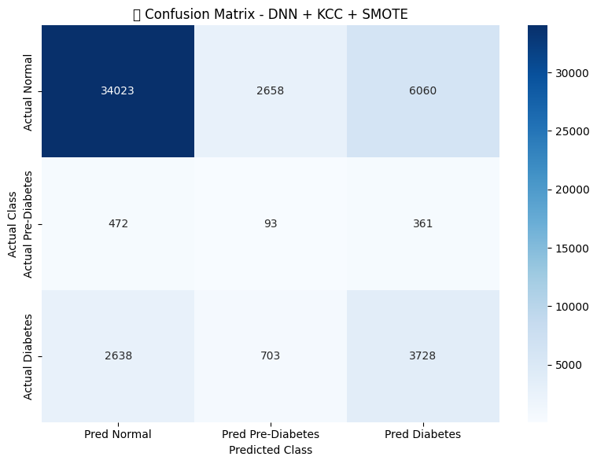

# 🧠 Optimizing Deep Neural Network for Diabetes Status Prediction

This project is my undergraduate thesis which focuses on optimizing Deep Learning models for predicting diabetes status (Normal, Pre-diabetes, Diabetes) based on health indicator data. The main objective is to improve model performance using various optimization techniques including feature selection, dimensionality reduction, data balancing, and attention mechanisms.

---

## 📊 Dataset Overview

- **Source**: [Kaggle – Diabetes Health Indicators Dataset](https://www.kaggle.com/datasets/alexteboul/diabetes-health-indicators-dataset)
- **Samples**: 253,680 rows
- **Features**: 21 health-related indicators
- **Target Classes**:
  - 0: Normal
  - 1: Pre-diabetes
  - 2: Diabetes

---

## 🧪 Research Workflow

The research was conducted in multiple stages to evaluate the performance of Deep Neural Network (DNN) models under various optimization techniques. The workflow is as follows:

### 🔹 Stage 1: Research Design
- Define problem and objectives
- Collect dataset
- Conduct exploratory data analysis (EDA)

### 🔹 Stage 2: Data Preprocessing
- Load dataset (`Dataset.csv`)
- Data cleaning
- Feature normalization

### 🔹 Stage 3: Model Development

Several variants of DNN models were developed and compared:

#### 🔸 1. Baseline Model (Default DNN)
- Stratified train-test split
- Train DNN without optimization
- Evaluate using Precision, Recall, F1-Score, ROC-AUC

#### 🔸 2. DNN + Self-Attention
- Add self-attention layer after base DNN
- Same train-test split
- Evaluate performance

#### 🔸 3. DNN + Feature Selection (KCC)
- Apply Kendall’s Correlation Coefficient to select features
- Train-test split on reduced features
- Train and evaluate DNN

#### 🔸 4. DNN + SMOTE
- Apply SMOTE oversampling on the training set
- Train and evaluate DNN on balanced data

#### 🔸 5. DNN + Autoencoders
- Train Autoencoder to perform nonlinear dimensionality reduction
- Extract latent features from encoder
- Train and evaluate DNN using compressed features

---

### 🔹 Stage 4: Optimization Combinations

To assess cumulative impact, the following combinations were tested:

#### 🔸 DNN with 2 Optimization Techniques
- DNN + KCC + Autoencoder
- DNN + KCC + Self-Attention
- DNN + KCC + SMOTE
- DNN + Autoencoder + Self-Attention
- DNN + Autoencoder + SMOTE
- DNN + Self-Attention + SMOTE

#### 🔸 DNN with 3 Optimization Techniques
- DNN + KCC + Autoencoder + Self-Attention
- DNN + KCC + Autoencoder + SMOTE
- DNN + KCC + Self-Attention + SMOTE
- DNN + Autoencoder + Self-Attention + SMOTE

#### 🔸 DNN with 4 Optimization Techniques (Final Model)
- DNN + KCC + Autoencoder + Self-Attention + SMOTE

---

### 🔹 Stage 5: Final Evaluation & Interpretation
- Evaluate all models using standard classification metrics:
  - Precision
  - Recall
  - F1-Score
  - ROC-AUC

---

## 🛠️ Libraries Used

- Python (Google Colab)
- Scikit-learn
- TensorFlow / Keras
- Imbalanced-learn 
- Matplotlib & Seaborn

---

## 📌 Key Results

This research aimed to develop a Deep Neural Network (DNN) model optimized using a combination of feature selection (Kendall’s Correlation Coefficient), dimensionality reduction (Autoencoders), data balancing (SMOTE), and attention mechanisms (Self-Attention), in order to improve multiclass classification of diabetes status (Normal, Pre-Diabetes, Diabetes).

The key findings are as follows:

1. **Baseline Performance**  
   The default DNN model without any optimization achieved an F1-Score of **0.4162**, serving as the reference point for further comparison.

2. **Individual Optimization Techniques**  
   - **SMOTE**: Significantly improved **Recall** (up to **0.4912**) but caused a drop in **Precision**, indicating a trade-off in learning from minority classes.  
   - **Self-Attention**: Achieved the highest **ROC-AUC score** (**0.7863**), enhancing class separability, though with limited impact on F1-Score.  
   - **Autoencoders**: Slightly improved **Precision**, but decreased performance in other metrics, suggesting that the latent features were suboptimal for classification.  
   - **KCC Feature Selection**: Improved model efficiency and stability while avoiding overfitting, helping the model to focus on the most relevant features.

3. **Combined Optimization Techniques**  
   - The best **quantitative performance** was achieved by combining **KCC + SMOTE**, which resulted in the highest **F1-Score of 0.4425**, outperforming the baseline in all major metrics.
   - Although the combination **KCC + SMOTE + Self-Attention** achieved the highest **average performance** (**0.5235**), the **KCC + SMOTE** model was selected as the **best model** due to its balance between performance, simplicity, and computational efficiency.

4. **Interpretability Insights**  
   - **KCC & Self-Attention** effectively highlighted features most correlated with diabetes status, enabling more focused learning by the DNN.  
   - **SMOTE** consistently boosted Recall by allowing the model to better understand minority class patterns, although it risked reducing Precision.  
   - **Autoencoders**, in this context, were less effective—potentially due to the loss of critical information during encoding and less representative latent space for classification tasks.

5. **Achievement of the Second Research Objective**  
   The second research objective was to assess the ability of the optimized DNN model to classify diabetes status into three classes. The best model (DNN + KCC + SMOTE) achieved an **overall accuracy of 74.59%**, **macro F1-score of 0.4425**, and **macro ROC-AUC of 0.7332**.  

   These results highlight that, although the performance for the Pre-Diabetes class remains relatively low, the proposed optimization approach successfully enhanced the model’s ability to recognize minority classes compared to the baseline.  

   

---

📄 _This repository reflects the culmination of my undergraduate thesis research at Universitas Muhammadiyah Riau._

[ID]
# 🧠 Optimasi Deep Neural Network untuk Prediksi Status Diabetes

Proyek ini merupakan tugas akhir (skripsi) sarjana saya yang berfokus pada optimalisasi model Deep Learning untuk memprediksi status diabetes (Normal, Pre-diabetes, Diabetes) berdasarkan data indikator kesehatan. Tujuan utamanya adalah meningkatkan performa model melalui berbagai teknik optimasi, termasuk seleksi fitur, reduksi dimensi, penyeimbangan data, dan mekanisme perhatian (self-attention).

---

## 📊 Ringkasan Dataset

- **Sumber**: [Kaggle – Diabetes Health Indicators Dataset](https://www.kaggle.com/datasets/alexteboul/diabetes-health-indicators-dataset)
- **Jumlah Sampel**: 253.680 baris
- **Fitur**: 21 indikator kesehatan
- **Kelas Target**:
  - 0: Normal
  - 1: Pre-diabetes
  - 2: Diabetes

---

## 🧪 Alur Penelitian

Penelitian dilakukan dalam beberapa tahapan untuk mengevaluasi performa model Deep Neural Network (DNN) dengan berbagai teknik optimasi. Alurnya sebagai berikut:

### 🔹 Tahap 1: Perancangan Penelitian
- Menentukan masalah dan tujuan
- Mengumpulkan dataset
- Melakukan eksplorasi data (EDA)

### 🔹 Tahap 2: Pra-pemrosesan Data
- Memuat dataset (`Dataset.csv`)
- Pembersihan data
- Normalisasi fitur

### 🔹 Tahap 3: Pengembangan Model

Beberapa varian model DNN dikembangkan dan dibandingkan:

#### 🔸 1. Model Dasar (DNN Default)
- Pembagian data stratifikasi (train-test split)
- Melatih DNN tanpa optimasi
- Evaluasi dengan Precision, Recall, F1-Score, ROC-AUC

#### 🔸 2. DNN + Self-Attention
- Menambahkan layer self-attention setelah DNN dasar
- Pembagian data tetap sama
- Evaluasi performa

#### 🔸 3. DNN + Seleksi Fitur (KCC)
- Menerapkan Kendall’s Correlation Coefficient untuk seleksi fitur
- Train-test split pada fitur yang diseleksi
- Melatih dan evaluasi DNN

#### 🔸 4. DNN + SMOTE
- Menerapkan oversampling SMOTE pada data latih
- Melatih dan evaluasi DNN pada data seimbang

#### 🔸 5. DNN + Autoencoder
- Melatih Autoencoder untuk reduksi dimensi non-linear
- Mengekstrak fitur laten dari encoder
- Melatih dan evaluasi DNN dengan fitur yang dikompresi

---

### 🔹 Tahap 4: Kombinasi Teknik Optimasi

Untuk menilai dampak kumulatif, kombinasi teknik berikut diuji:

#### 🔸 DNN dengan 2 Teknik Optimasi
- DNN + KCC + Autoencoder  
- DNN + KCC + Self-Attention  
- DNN + KCC + SMOTE  
- DNN + Autoencoder + Self-Attention  
- DNN + Autoencoder + SMOTE  
- DNN + Self-Attention + SMOTE  

#### 🔸 DNN dengan 3 Teknik Optimasi
- DNN + KCC + Autoencoder + Self-Attention  
- DNN + KCC + Autoencoder + SMOTE  
- DNN + KCC + Self-Attention + SMOTE  
- DNN + Autoencoder + Self-Attention + SMOTE  

#### 🔸 DNN dengan 4 Teknik Optimasi (Model Akhir)
- DNN + KCC + Autoencoder + Self-Attention + SMOTE

---

### 🔹 Tahap 5: Evaluasi dan Interpretasi Akhir
- Semua model dievaluasi dengan metrik klasifikasi standar:
  - Precision
  - Recall
  - F1-Score
  - ROC-AUC

---

## 🛠️ Library yang Digunakan

- Python (Google Colab)
- Scikit-learn
- TensorFlow / Keras
- Imbalanced-learn
- Matplotlib & Seaborn

---

## 📌 Hasil Utama

Penelitian ini bertujuan mengembangkan model Deep Neural Network (DNN) yang dioptimalkan dengan kombinasi teknik seleksi fitur (Kendall’s Correlation Coefficient), reduksi dimensi (Autoencoders), penyeimbangan data (SMOTE), dan mekanisme perhatian (Self-Attention) untuk meningkatkan klasifikasi multikelas status diabetes (Normal, Pre-Diabetes, Diabetes).

Temuan utama sebagai berikut:

1. **Performa Dasar**  
   Model DNN default tanpa optimasi menghasilkan F1-Score sebesar **0.4162** sebagai titik acuan untuk perbandingan selanjutnya.

2. **Teknik Optimasi Individu**  
   - **SMOTE**: Meningkatkan **Recall** secara signifikan (hingga **0.4912**) namun menurunkan **Precision**, menunjukkan adanya trade-off.  
   - **Self-Attention**: Mencapai skor **ROC-AUC tertinggi** (**0.7863**), meningkatkan kemampuan pemisahan kelas meskipun dampaknya pada F1-Score terbatas.  
   - **Autoencoder**: Sedikit meningkatkan **Precision**, namun menurunkan performa metrik lain, menunjukkan bahwa fitur laten kurang optimal.  
   - **Seleksi Fitur KCC**: Meningkatkan efisiensi dan stabilitas model sambil menghindari overfitting, memungkinkan model fokus pada fitur paling relevan.

3. **Kombinasi Teknik Optimasi**  
   - Performa **kuantitatif terbaik** dicapai dengan kombinasi **KCC + SMOTE**, menghasilkan **F1-Score tertinggi sebesar 0.4425**, melampaui baseline di semua metrik utama.  
   - Meskipun kombinasi **KCC + SMOTE + Self-Attention** menghasilkan **rata-rata performa tertinggi** (**0.5235**), model **KCC + SMOTE** dipilih sebagai **model terbaik** karena keseimbangan performa, kesederhanaan, dan efisiensi komputasi.

4. **Insight Interpretabilitas**  
   - **KCC & Self-Attention** secara efektif mengidentifikasi fitur yang paling berkorelasi dengan status diabetes, membantu pembelajaran yang lebih fokus.  
   - **SMOTE** secara konsisten meningkatkan Recall dengan memungkinkan model memahami pola kelas minoritas, meskipun Precision cenderung turun.  
   - **Autoencoder**, dalam konteks ini, kurang efektif—kemungkinan karena hilangnya informasi penting saat encoding dan kurang representatif untuk klasifikasi.

5. **Pencapaian Tujuan Penelitian Kedua**  
   Tujuan penelitian kedua adalah mengevaluasi kemampuan model DNN hasil optimasi dalam mengklasifikasikan status diabetes ke dalam tiga kelas. Model terbaik (DNN + KCC + SMOTE) mencapai **akurasi keseluruhan sebesar 74.59%**, **F1-score makro 0.4425**, dan **ROC-AUC makro 0.7332**.  

   Hasil ini menegaskan bahwa meskipun performa untuk kelas **Pra-Diabetes** masih rendah, pendekatan yang diusulkan mampu meningkatkan kemampuan model dalam mengenali kelas minoritas dibandingkan baseline.  

   

---

📄 _Repositori ini mencerminkan puncak dari penelitian skripsi saya di Universitas Muhammadiyah Riau._

