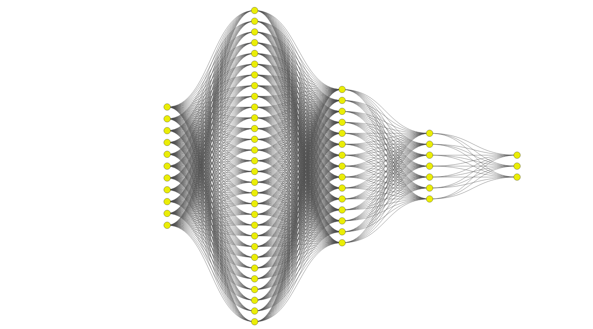

# [EN]
## 🌱 Seed Exploration with Suggested Neural Network Architecture

This project focuses on seed data exploration using a structured deep neural network (DNN) architecture, as illustrated in the `suggested_dnn-arch_pattern.png` diagram.

## 🧠 Model Architecture

The model adopts a multi-layer feedforward neural network with the following neuron configuration:

- **Input Layer**: 21 neurons  
- **Hidden Layer 1**: 64 neurons  
- **Hidden Layer 2**: 32 neurons  
- **Hidden Layer 3**: 16 neurons  
- **Output Layer**: 3 neurons

---

# [ID]
## 🌱 Eksplorasi Benih dengan Arsitektur Jaringan Syaraf Tiruan yang Disarankan

Proyek ini berfokus pada eksplorasi data benih menggunakan arsitektur **Deep Neural Network (DNN)** yang terstruktur, seperti yang digambarkan dalam diagram `suggested_dnn-arch_pattern.png`.

## 🧠 Arsitektur Model

Model ini menggunakan jaringan saraf maju (*feedforward neural network*) berlapis ganda dengan konfigurasi neuron sebagai berikut:

- **Lapisan Input**: 21 neuron  
- **Lapisan Tersembunyi 1**: 64 neuron  
- **Lapisan Tersembunyi 2**: 32 neuron  
- **Lapisan Tersembunyi 3**: 16 neuron  
- **Lapisan Output**: 3 neuron

---
