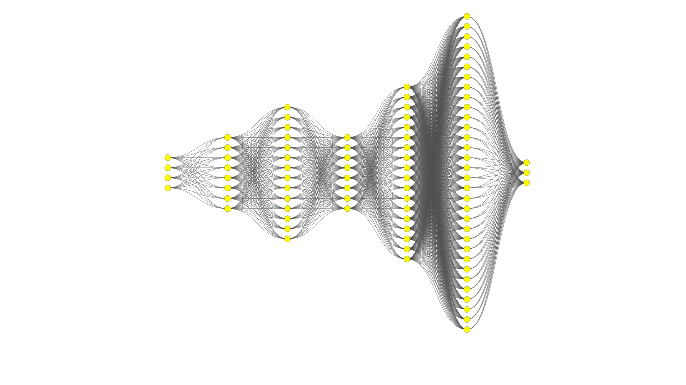

# 🧪 Deep Neural Network (DNN) Architecture Exploration

This project focuses on exploring various deep neural network (DNN) architectures for seed classification, based on relevant previous studies as the foundation for architectural design decisions.

## 🎯 Objective

The main goal of this exploration is to answer the following question:

> *Is the DNN architecture used during the seed exploration phase (using the best-performing seed: 44) already optimal, or can it be further improved through architectural experimentation?*

To maintain consistency and fairness in comparison, **Seed 44**—identified as the best-performing seed from prior exploration—is used across all experiments in this phase.

---

## 🏗️ Explored Architectures

Multiple architectures were tested, varying in the number of hidden layers and neuron counts per layer. The configurations are as follows:

| Model Code | Hidden Layers | Neurons per Layer Configuration      |
|------------|----------------|--------------------------------------|
| A1         | 3              | 32, 64, 128                          |
| A2         | 3              | 32, 96, 160                          |
| A3         | 3              | 64, 96, 128                          |
| B1         | 4              | 32, 64, 128, 256                     |
| B2         | 4              | 32, 96, 160, 256                     |
| B3         | 4              | 64, 96, 128, 256                     |
| C1         | 5              | 32, 64, 32, 128, 256                 |
| C2         | 5              | 32, 96, 32, 160, 256                 |
| C3         | 5              | 64, 96, 64, 128, 256                 |
| D1         | 3              | 128, 64, 32                          |
| D2         | 3              | 32, 16, 8                            |

Each model is trained using consistent hyperparameters and evaluation protocols to ensure fair performance comparison.

---

## 📈 Evaluation Goals

This architectural exploration aims to:

- Identify which configuration achieves the best overall performance.
- Compare the best-performing architecture from this phase against the architecture used in the previous seed exploration (baseline).
- Recommend an optimal DNN architecture for seed classification tasks.

---
# [ID]

## 🧪 Eksplorasi Arsitektur Jaringan Syaraf Tiruan (DNN)

Eksplorasi ini dilakukan untuk menentukan arsitektur jaringan saraf tiruan (DNN) terbaik dalam memodelkan data benih, dengan mengacu pada penelitian-penelitian terdahulu yang relevan sebagai dasar pertimbangan desain arsitektur.

## 🎯 Tujuan Eksplorasi

Tujuan utama dari eksplorasi ini adalah untuk menjawab pertanyaan berikut:

> *Apakah arsitektur DNN yang digunakan pada eksplorasi seed (dengan seed terbaik: 44) sudah optimal, atau dapat ditingkatkan melalui eksplorasi arsitektur lebih lanjut?*

Eksplorasi dilakukan menggunakan **seed 44**, yang sebelumnya menghasilkan performa terbaik pada tahap eksplorasi seed. Seed ini digunakan secara konsisten untuk menjaga validitas perbandingan antara berbagai arsitektur.

---

## 🏗️ Rancangan Arsitektur yang Dieksplorasi

Eksperimen dilakukan dengan mencoba berbagai kombinasi jumlah *hidden layer* dan jumlah neuron di tiap layer. Berikut adalah konfigurasi arsitektur yang dievaluasi:

| Kode Model | Jumlah Hidden Layer | Konfigurasi Neuron per Layer     |
|------------|----------------------|----------------------------------|
| A1         | 3                    | 32, 64, 128                      |
| A2         | 3                    | 32, 96, 160                      |
| A3         | 3                    | 64, 96, 128                      |
| B1         | 4                    | 32, 64, 128, 256                 |
| B2         | 4                    | 32, 96, 160, 256                 |
| B3         | 4                    | 64, 96, 128, 256                 |
| C1         | 5                    | 32, 64, 32, 128, 256             |
| C2         | 5                    | 32, 96, 32, 160, 256             |
| C3         | 5                    | 64, 96, 64, 128, 256             |
| D1         | 3                    | 128, 64, 32                      |
| D2         | 3                    | 32, 16, 8                        |

Setiap arsitektur diuji menggunakan metode pelatihan yang seragam, dengan parameter yang dikontrol secara konsisten untuk memastikan keadilan dalam evaluasi performa.

---

## 📈 Evaluasi dan Perbandingan

Hasil dari eksplorasi ini akan digunakan untuk:

- Menentukan arsitektur mana yang memberikan performa terbaik.
- Membandingkan hasil eksplorasi arsitektur dengan performa arsitektur pada eksplorasi seed (baseline).
- Menyusun rekomendasi arsitektur DNN yang optimal untuk kasus data benih.

---
